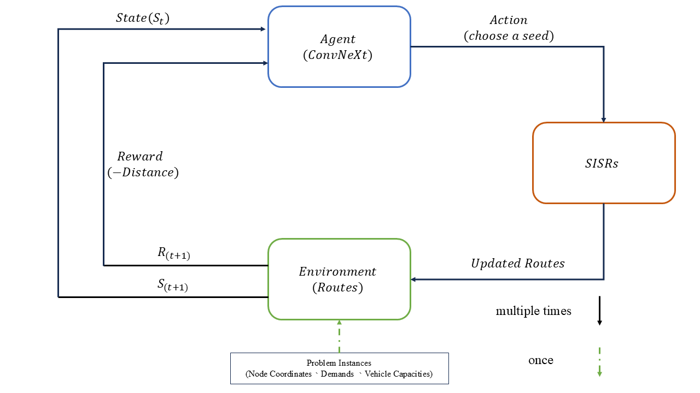

# DRL-SISR-HCVRP-Optimization

Solving the **Heterogeneous Capacitated Vehicle Routing Problem (HCVRP)** using a hybrid approach that combines **Deep Reinforcement Learning (DRL)** and the **SISR (Slack Induction by String Removals)** heuristic algorithm.

---

## Overview

The Heterogeneous Capacitated Vehicle Routing Problem (HCVRP) is an NP-hard combinatorial optimization problem in which a fleet of vehicles with different capacities must serve a set of customers at minimum cost. Classical heuristics can get trapped in local optima, while pure DRL approaches may lack fine-grained search capability.

This project proposes two hybrid DRL-SISR methods that use a CNN-based DRL agent to guide the SISR local search, improving both solution quality and search efficiency over traditional approaches.



### Two Hybrid Strategies

| Method | Description |
|--------|-------------|
| **DRL-SNS** | DRL selects the **seed node** for SISR string removal; the rest of the search follows the standard SISR procedure. Lightweight integration with DRL acting as a smart initialization. |
| **DRL-RR** | DRL takes a **larger role in decision-making** throughout the SISR process, guiding more steps of the local search for stronger optimization. |

---

## Environment Setup

This project uses **Conda** for environment management. All dependencies (PyTorch, CUDA 11.6, NumPy, TensorFlow, etc.) are specified in `hcvrp.yaml`.

```bash
# Clone the repository
git clone https://github.com/eh102/DRL-SISR-HCVRP-Optimization.git
cd DRL-SISR-HCVRP-Optimization

# Create and activate the Conda environment
conda env create -f hcvrp.yaml
conda activate hcvrp
```

> **Requirements:** CUDA-compatible GPU recommended. The environment is configured for CUDA 11.6.

---

## File Structure

```
DRL-SISR-HCVRP-Optimization/
├── hcvrp.yaml               # Conda environment specification
├── hcvrp_solver.py          # Baseline: pure SISR solver for HCVRP
├── tester_hcvrp.py          # Outputs the iteration process of hcvrp_solver.py
├── drl_sns_train.py         # Train: DRL-SNS method (DRL selects seed node)
├── drl_sns_eval.py          # Evaluate: DRL-SNS method
├── drl_rr_train.py   # Train: DRL-Full method (DRL guides more decisions)
├── drl_rr_eval.py    # Evaluate: DRL-Full method
└── images/
    └── DRL_Guiding_process.png
```

---


## Method

The core idea is to replace the random or heuristic decision steps inside SISR with a trained DRL agent:

- **SISR** iteratively removes strings of nodes from routes and reinserts them to escape local optima.
- **DRL agent** (CNN-based) observes the current solution state and outputs an action to guide the ruin/recreate process.
- **DRL-SNS**: DRL intervenes only at seed node selection — minimal overhead, easy to integrate.
- **DRL-RR**: DRL participates in more decision steps — stronger guidance, higher optimization potential.

---

## Tech Stack

| Category | Tools |
|----------|-------|
| Language | Python 3.7 |
| Deep Learning | PyTorch 1.13, CUDA 11.6 |
| Scientific Computing | NumPy, SciPy |
| Visualization | Matplotlib, TensorBoard |

---

## License

This project is licensed under the [MIT License](LICENSE).

---
